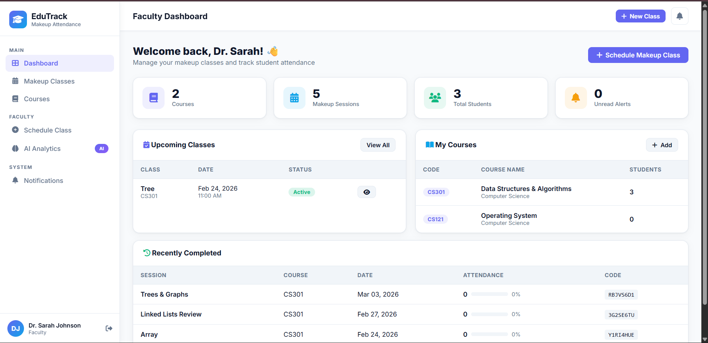
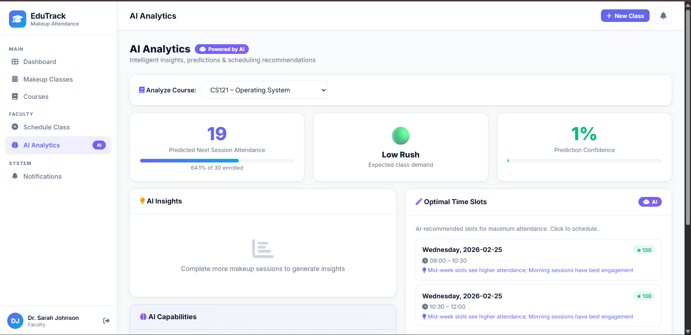
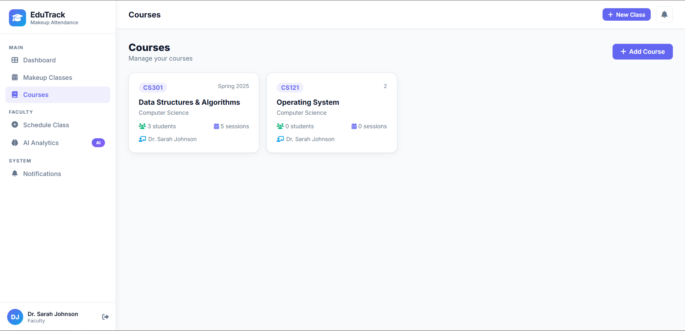
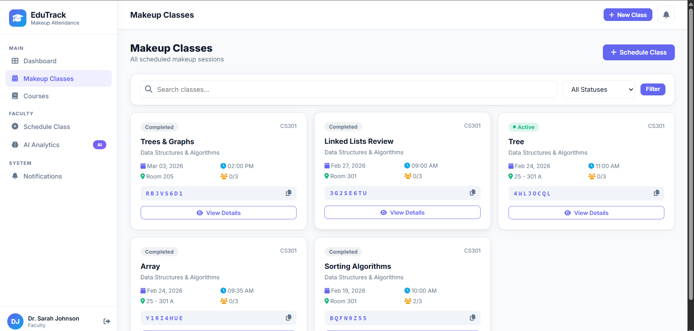
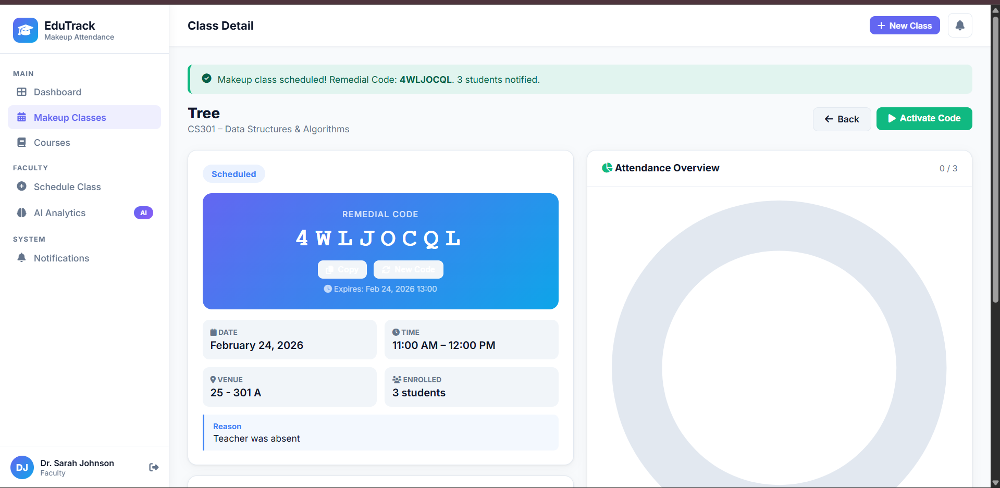

# EduTrack – Make-Up Class & Remedial Code Module

A full-stack Django web application for managing makeup classes, remedial attendance codes, and AI-powered insights.

## Features

### Faculty Features
- Schedule makeup classes with title, date, time, venue, and reason
- Auto-generated unique **8-character remedial code** per session
- Activate/deactivate the code when the session begins
- Regenerate code if needed
- View real-time attendance chart with Chart.js
- See AI-powered attendance predictions & scheduling recommendations

### Student Features
- Mark attendance using remedial code (one-time per session)
- View upcoming makeup sessions
- Attendance history with course/date/method filters
- Enroll in courses using course code

### AI Integration
- **Attendance Prediction** – estimates expected turnout using historical data, day-of-week, and time-of-day factors
- **Class Rush Prediction** – rates sessions as High / Medium / Low rush
- **Smart Scheduling Recommendations** – suggests optimal time slots
- **Automated Notifications** – auto-alerts all enrolled students when class is scheduled or code is activated
- **Face Recognition Ready** – models/API hook ready (enable with `face-recognition` library)

## Setup

### 1. Install Dependencies
```bash
pip install -r requirements.txt
```

### 2. Run Migrations
```bash
python manage.py makemigrations
python manage.py migrate
```

### 3. Load Demo Data
```bash
python setup_demo.py
```

### 4. Start Server
```bash
python manage.py runserver
```

### 5. Open App
- App: http://127.0.0.1:8000/
- Admin: http://127.0.0.1:8000/admin/

## Demo Credentials

| Role    | Username  | Password |
|---------|-----------|----------|
| Admin   | admin     | admin123 |
| Faculty | faculty1  | pass123  |
| Student | student1  | pass123  |
| Student | student2  | pass123  |
| Student | student3  | pass123  |

## Project Structure

```
makeup_attendance/
├── manage.py
├── requirements.txt
├── setup_demo.py
├── makeup_project/
│   ├── settings.py
│   └── urls.py
└── attendance_app/
    ├── models.py         # UserProfile, Course, MakeUpClass, AttendanceRecord, Notification
    ├── views.py          # All view logic
    ├── urls.py           # URL routing
    ├── forms.py          # Django forms
    ├── ai_service.py     # AI prediction, scheduling, notifications
    ├── admin.py
    └── templates/
        └── attendance_app/
            ├── base.html                  # Shared layout + sidebar
            ├── login.html
            ├── register.html
            ├── faculty_dashboard.html
            ├── student_dashboard.html
            ├── schedule_makeup.html
            ├── makeup_list.html
            ├── makeup_detail.html         # With Chart.js attendance chart
            ├── mark_attendance.html
            ├── my_attendance.html
            ├── notifications.html
            ├── course_list.html
            ├── add_course.html
            └── ai_analytics.html
```

## API Endpoints

| Endpoint | Description |
|----------|-------------|
| `GET /api/unread-count/` | Unread notification count (JSON) |
| `GET /api/attendance-chart/<pk>/` | Attendance stats for a class (JSON) |
| `POST /makeup/<pk>/activate/` | Activate remedial code |
| `POST /makeup/<pk>/complete/` | Mark class as complete |
| `POST /makeup/<pk>/regenerate-code/` | Generate new code |
| `POST /courses/enroll/` | Student course enrollment |

## Technology Stack
- **Backend**: Django 4.x, SQLite (swap to PostgreSQL for production)
- **Frontend**: HTML5, CSS3 (custom design system), Vanilla JavaScript
- **Charts**: Chart.js 4.x
- **Icons**: Font Awesome 6
- **Fonts**: Inter (Google Fonts)

---

## 📸 Application Snapshots

### 🏠 Dashboard


---

### 📊 AI Analytics


---

### 📚 Courses Section


---

### 📝 Make-Up Classes Section


---

### 🔐 Remedial Code Section


---
